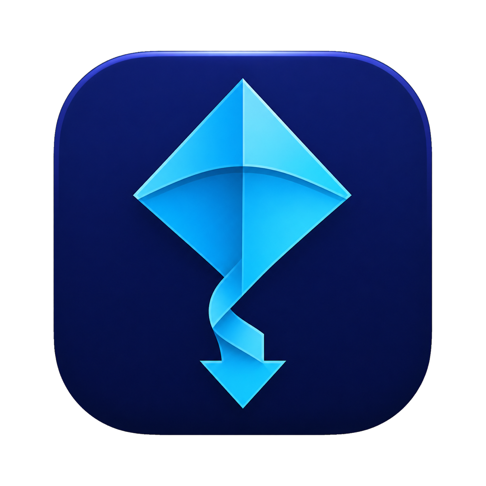
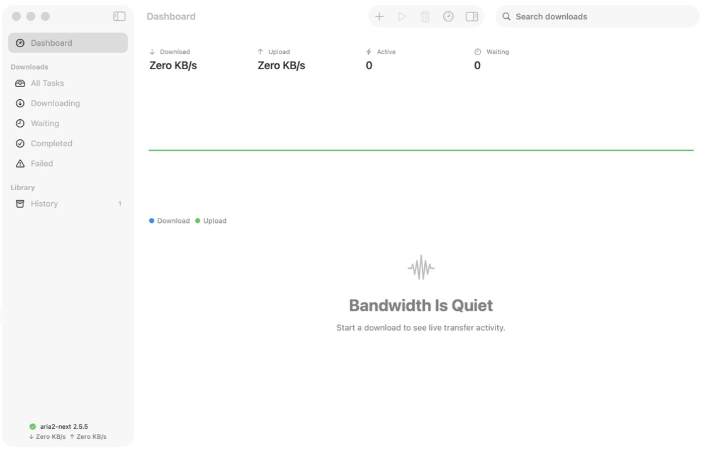

# Super DD

<p align="center">
  
</p>

<p align="center">面向 macOS 26 及更新系统的原生多协议下载器。</p>

<p align="center">
  <a href="https://github.com/IchenDEV/super-dd/actions/workflows/ci.yml"></a>
  <a href="https://github.com/IchenDEV/super-dd"></a>
  <a href="https://www.swift.org"></a>
  <a href="LICENSE"></a>
  <a href="THIRD_PARTY_NOTICES.md"></a>
</p>

Super DD 以 Swift 6.2、SwiftUI、AppKit 和 Apple 系统框架实现桌面体验，通过只监听 loopback 的 JSON-RPC 2.0 驱动独立 `aria2-next` sidecar。仓库没有第三方 Swift Package、UI 框架、WebView、Electron 或跨平台运行时。



## 主要能力

### 下载入口

- HTTP/HTTPS/FTP、BitTorrent、Magnet、Metalink、ED2K、Thunder、HLS 与 DASH。
- `.torrent`、`.metalink`、`.meta4` 文件，URL/String 拖放，剪贴板监控和深链。
- Safari Web Extension 工程，以及可直接加载或发布的 Chromium/Firefox 扩展包。
- 浏览器当前页面、右键链接、页面全部链接、Cookie、Referer、User-Agent 和请求头转发。

### 可靠性与任务控制

- aria2 会话恢复、自动重试与指数退避、手动重试、校验和与完整性检查。
- 高/普通/低优先级、队列置顶/上移/下移/置底、全局与单任务限速。
- 同名文件保留两份、覆盖或跳过；任务移除和“移到废纸篓”分开处理。
- SQLite 历史保存来源与安全重试参数，完成或失败后仍可再次下载。
- 凭据和 Cookie Profile 存入 macOS Keychain，设置文件与诊断包不保存密码。

### BitTorrent 与自动化

- DHT v4/v6、PEX、LPD、加密、Peer、Tracker、文件选择、做种比例和时间。
- Tracker 源、peer blocklist、ED2K `server.met` / `nodes.dat` 自动缓存。
- 纯 Swift 创建 `.torrent`，支持单文件、目录、多 Tracker、私有种子与 SHA-1 piece。
- RSS/Atom 订阅、正则规则、去重、目标目录、标签和暂停添加。
- `.torrent`/Metalink 监视目录、可配置搜索提供商、任务标签。
- NAT-PMP 与 UPnP 端口映射；可加载 CIDR/范围 CSV 为 Peer 标注地区。

### 媒体与完成工作流

- HLS Master/Media Playlist 变体选择、字节范围、fMP4 init segment、断点文件。
- DASH `SegmentList`、清晰度选择、可暂停/恢复的原生媒体任务。
- 使用 macOS 自带 `ditto`/`bsdtar` 解压 ZIP、CBZ、TAR、TGZ、TBZ2、TXZ、7z 和 RAR，并拒绝路径穿越条目。
- 完成后 Reveal、Open、删除归档、运行显式配置的命令，或倒计时退出/睡眠/关机。

### 原生 macOS 与远程控制

- macOS 26 NavigationSplitView、统一工具栏、Inspector、Settings 和 Liquid Glass。
- 浅色/深色/跟随系统；SF Symbols 使用语义前景色，深色模式不再出现黑底黑图标。
- Notification Center、Dock 角标、菜单栏速率、防止空闲睡眠和登录启动。
- 默认关闭的远程 Web UI/API，可选择只监听本机或局域网，全部控制请求要求 Bearer Secret，并有速率限制与安全响应头。
- MDXP 1.0：`motrix/initialize`、下载提交/取消、任务列表/控制、统计、引擎状态、URL probe/resolve。
- `superddctl` 命令行客户端及 `--headless` 后台启动模式。
- JavaScriptCore resolver 插件运行在独立 helper 进程，无文件/网络桥接、五秒超时；Registry 安装要求 SHA-256。

边界和逐项状态见[功能对等矩阵](Docs/FEATURE_PARITY.md)。DRM/加密 HLS、动态 DASH `SegmentTemplate`、密码归档和 Motrix 第三方插件二进制兼容不作虚假承诺。

## 快速开始

要求 macOS 26+、Xcode 26+ 与 Swift 6.2。Apple Silicon 和 Intel Mac 都有锁定校验和的 `aria2-next` 引擎资产。

```bash
git clone https://github.com/IchenDEV/super-dd.git
cd super-dd
./script/build_and_run.sh
```

脚本会校验并获取 `aria2-next 2.5.5`、构建全部 SwiftPM 产品、打包浏览器扩展、生成 `dist/SuperDD.app`、ad-hoc 签名并启动。

| 命令 | 用途 |
| --- | --- |
| `swift test` | 运行 Swift Testing 测试 |
| `./script/build_and_run.sh` | 构建、打包并启动 |
| `./script/build_and_run.sh --verify` | 启动并检查进程与签名 |
| `./script/build_and_run.sh --package` | 只生成并验证 `.app` |
| `./script/package_browser_extensions.sh` | 生成 Chromium、Firefox 和 Safari 包 |
| `swift run superddctl --help` | 查看 MDXP CLI |

### 浏览器扩展

执行打包脚本后，产物位于 `dist/browser-extensions/`：

- `super-dd-chromium.zip`：Chrome、Edge、Brave 等 Manifest V3 浏览器。
- `super-dd-firefox.zip`：Firefox WebExtension。
- `super-dd-safari-project.zip`：由 Apple converter 生成且可无签名编译的 Safari App Extension 工程。

在“设置 → Network”复制扩展 Secret；扩展默认连接 `http://127.0.0.1:29110`。实际端口冲突时以设置页显示值为准。

### 远程与 CLI

在“设置 → Network”启用 Remote Control，默认仍只监听 `127.0.0.1`。局域网监听是独立开关；公网使用必须放在可信 TLS 反向代理后面。

```bash
export SUPERDD_REMOTE_URL=http://127.0.0.1:29120/
export SUPERDD_REMOTE_SECRET='设置页显示的 Secret'
swift run superddctl ping
swift run superddctl add https://example.com/file.iso
swift run superddctl list
```

### Resolver 插件

插件放在 `~/Library/Application Support/SuperDD/Plugins/<plugin-id>/`：

```json
{
  "id": "example-resolver",
  "name": "Example Resolver",
  "version": "1.0.0",
  "entry": "index.js"
}
```

`index.js` 定义同步 `resolve(input)`，返回 URL 字符串或 URL 数组。宿主不会向脚本暴露文件系统、Keychain、Shell 或网络 API。

## 架构与数据

```text
SwiftUI / AppKit
      │
DownloadStore + native isolated services
      ├── loopback JSON-RPC ── aria2-next sidecar
      ├── authenticated HTTP ─ browser / Web UI / MDXP
      └── helper process ───── JavaScriptCore resolver plugin
```

应用数据位于 `~/Library/Application Support/SuperDD/`：设置、aria2 session、SQLite 历史、任务元数据、媒体断点、自动化去重记录、引擎资源和插件。更完整的信任边界见[架构说明](Docs/ARCHITECTURE.md)。

## 发布

本地开发包使用 ad-hoc 签名。正式发布脚本支持 Developer ID、Hardened Runtime、Apple Notary Service、staple、Gatekeeper assessment、DMG 校验和 SHA-256：

```bash
SUPERDD_CODESIGN_IDENTITY='Developer ID Application: …' \
SUPERDD_NOTARY_PROFILE=superdd-notary \
./script/release.sh 0.2.0
```

`.github/workflows/release.yml` 在 `v*` tag 上执行同一链路。私钥、Apple ID 和 app-specific password 只能放入 GitHub Actions Secrets。原生更新器只接受带匹配 SHA-256 的 GitHub Release 资产。

## 许可

Super DD 的 Swift、JavaScript 和脚本源码使用 [MIT License](LICENSE)。`aria2-next` 是独立 sidecar，按 GPLv2 及其上游 OpenSSL linking exception 分发；版本、校验和和完整许可证见[第三方声明](THIRD_PARTY_NOTICES.md)。

产品方向与传输能力参考 [Motrix Next](https://github.com/AnInsomniacy/motrix-next)、[Motrix](https://github.com/agalwood/Motrix) 与 [aria2-next](https://github.com/AnInsomniacy/aria2-next)。
